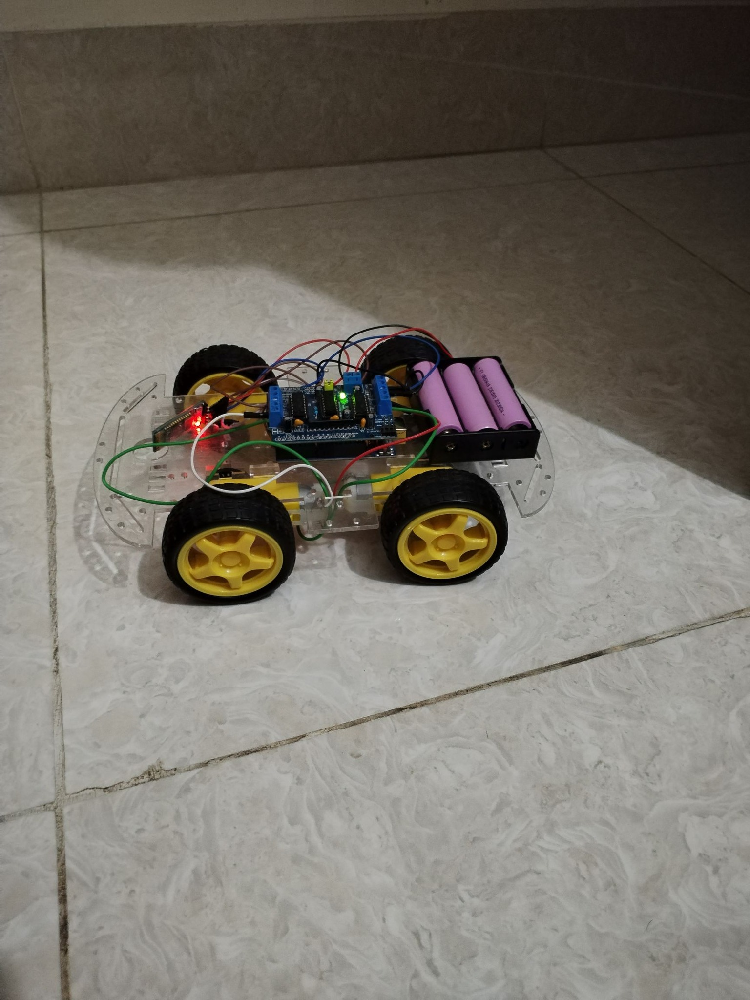

# Mobile Controlled Car

**Project Overview**:
This project demonstrates a **Mobile Controlled Rover** using **Arduino** and a **Bluetooth module (HC-05)**. The car is controlled remotely using a mobile app developed with **MIT App Inventor**. The Bluetooth module communicates with the Arduino to control the movement of the car through the **L293D motor shield**. The car can move forward, backward, and turn left or right based on the commands sent via Bluetooth.

## Components Required:
### <h4>Components required in this module:</h4>
<ol>
  <li><p>Arduino (e.g., Arduino Uno)</p></li>
  <li><p>Motor Shield L293D</p></li>
  <li><p>Chassis Set</p></li>
  <li><p>Jumper Wires</p></li>
  <li><p>Bluetooth Module (HC-05)</p></li>
  <li><p>PC</p></li>
  <li><p>Arduino Cable</p></li>
</ol>

### System Diagram:


**Figure 1**: The system setup with the Arduino, motor shield, Bluetooth module, and chassis.

## Working Principle:
The rover operates through Bluetooth communication between the **Arduino** and the **mobile device**. The mobile app (created with **MIT App Inventor**) sends control signals to the **HC-05 Bluetooth module**, which then communicates with the Arduino. The Arduino processes these signals and drives the motors accordingly using the **L293D motor shield**.

### Features:
- **Mobile Control**: Use buttons on the mobile app to control the car’s movement.
- **Bluetooth Communication**: Use Bluetooth (HC-05) to send commands wirelessly from the mobile app to the Arduino.
- **Arduino-based Motor Control**: Use the L293D motor shield to control the car’s motors.

## Code Explanation:
The Arduino code listens for commands from the Bluetooth module and drives the motors based on the received signals. The mobile app sends commands through the Bluetooth serial connection.

```cpp
// Arduino code for controlling the mobile-controlled rover
// Code for controlling the rover with Bluetooth commands
